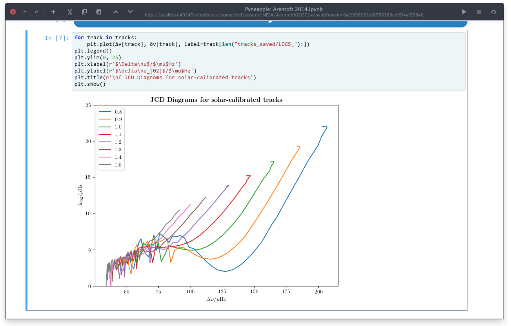

# Pyneapple: Interactive Jupyter Notebooks for GTK

I've been actively using [Pineapple](http://github.com/nwhitehead/pineapple) but its development seems to have stalled and/or been stymied by a bunch of bugs in various projects (which I've duly reported upstream). Since I use it as much as I do, I decided to re-implement things in Python + wxWidgets. This has a couple of advantages:

- No explicit dependence on daemonising an external server process, which may continue running in the background if the main GUI application fails
- Better integration with Linux desktop environments (at the cost of Mac integration obviously, but I use a global menu and the GUI hasn't changed all than much functionally)
- Since I'm dogfooding this for my PhD research I can be assured of updates (albeit with a slightly more painful than usual update path)

This was my winter break project of 2017/2018, and I may not be able to update it much until I'm done with quals. Expect bugs (although thanks to Nathan's excellent engineering these may be few — this project owes much to the original Pineapple).


## Requirements

I wrote this with GObject introspection and it uses a WebKit2 webview to access Jupyter notebooks proper. As far as I know these (via [PyGObject](http://pygobject.readthedocs.io/en/latest/getting_started.html)) are the only requirements. I've also updated some of Nathan's scripts to use Promises, which are only implemented in Jupyter 5.1 and above.

## Running

Install this with

```python
python3 setup.py build
python3 setup.py install
```

And execute this as

```bash
pyneapple <filename>
```

Untitled files will be populated in the temp directory (by default `~/.local/share/pyneapple/tmp`) when File > New is invoked, or the program is run without arguments with no existing open windows. These are retained between launches.

As a `Gtk.Application`, `pyneapple` will automatically keep one instance of the Jupyter notebook server running, keep track of recently opened files, and terminate the server when all windows are closed (on Linux).

Configuration (e.g. default theme, location of Jupyter config directories) can be changed by creating either `~/.pyneapplerc`, `~/.config/pyneapple/pyneapplerc` or `pyneapplerc` in the working directory. Look at `defaults.cfg` for default values.


